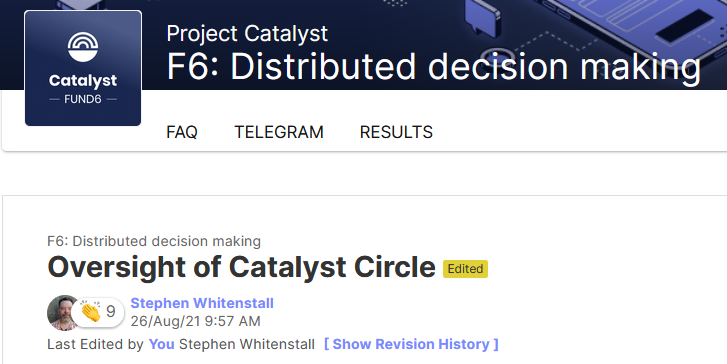

# Oversight of Catalyst Circle

## Quality Assurance DAO

This site is maintained by QA-DAO in collaboration with the Cardano and Project Catalyst communities. All content recorded here is open source, licensed under Apache 2.0.

[Quality Assurance DAO](https://quality-assurance-dao.github.io) have submitted a Fund 6 Proposal in the F6: Distributed decision making challenge. Read the Project Catalyst Fund 6 Proposal [Oversight of Catalyst Circle](https://cardano.ideascale.com/a/dtd/Oversight-of-Catalyst-Circle/370088-48088) on Ideascale.

## Fund 6 Proposal : Oversight of Catalyst Circle

### **Problem statement :**

Catalyst Circle requires independent oversight.

A community maintained oversight of Catalyst Circle requires support to be sustainable.

### **Describe your solution to the problem**

Provide independent oversight of Catalyst Circle.

Resource an active site that documents & tracks the activities of the Catalyst Circle

