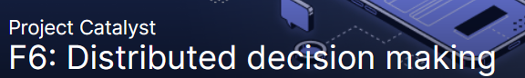

# Fund 6 Proposal: Power Up The Catalyst Circle

## Ideascale Link



## Proposers :

Project Catalyst Admin, Dor Garbash , Juliane Montag, Dean Jayes, Felix Weber, Lauris Steglics & Victor Corcino.

## **Problem statement :**

Without a budget to fund its operation, Catalyst Circle can't produce meaningful outcomes. 

## **Describe your solution to the problem**

Funding from the Cardano Community via Catalyst helps to ensure increased accountability of participating CC members. 

## **Relevant experience**

We are elected leaders from the ecosystem serving a key role in turning Catalyst into the largest decentralized innovation fund in the world 

## **Detailed plan (not required) - Fill in here any additional details**

### **The Catalyst Circle**

IOG is currently managing the Catalyst Project, with the aspiration to decentralize Governance to the community. The Catalyst Circle is the first experiment to establish a decentralized instance, that has four major goals:


**1) To facilitate communication between the different functional groups**



**2) To provide a heads-up when red lines are crossed within a certain group**



**3) To suggest improvements on plans and processes that shape Project Catalyst**



**4) To define the election process for Circle V2**


#### Link:



### **Member duties and responsibilities**

Like Project Catalyst itself, the Circle will also evolve over time. Initially, elected members will serve 3-month terms, and elections will follow to continue improving and iterating the process. For elected members, we have identified these initial duties and responsibilities. Each member of the Circle should:

* Represent the community that selected them
* Exercise their own best judgement about matters that come before the Circle
* Familiarize other members with the projects, activities, aims, hopes, and concerns of their communities
* Periodically take the opportunity to introduce policy proposals into the Circle's agenda for consideration
* Inform their communities about initiatives of the Circle

### **Each member also has the responsibility to:**

* Regularly attend meetings every two weeks
* Maintain an agile backlog list to track issues between meetings
* Review and comment on agenda issues ahead of time
* Maintain awareness of the interests and concerns of their community
* Disseminate the Circle's outputs transparently and accessibly
* Learn and practice effective meeting procedures
* Produce an election protocol document for the next elections
* Attend training sessions focused on inclusive and lean startup leadership techniques
* Provide feedback on the effectiveness of the Circle

Members will be able to set each meeting's agenda and periodically introduce policy proposals into the Catalyst Circle for consideration. The 'minimal functional group' is the bootstrapping version, based on consultations with leaders within the Catalyst community, an expert group in the field of novel governance structures.

As trusted best practice is established, the Circle might grow and divide. Maybe the future has many 'Circles'? Ultimately, it will be up to members to advance our goal to legitimise decentralized governance, paving the way for an alternative to the status quo, and continuing to break new ground in building the future of blockchain governance.

### **Roadmap** (3 months) November 2021 - January 2022

Catalyst Circle 1, which has been operating since 12th of July 2021. The group has established a process to funnel work mainly focusing on addressing major problems identified within the various stakeholder groups (for more details please see here: https://trello.com/b/DRBO6qyF/catalyst-prioritized-problems).

The roadmap for Catalyst Circle 2 is mainly driven by the goals and responsibilities mentioned above. The backlog of problems and issues already backlogged in the trello board will give the CC2 a starting point to execute on. Nevertheless, since the Catalyst Circle 1 is still in its beginnings, additional issues will naturally evolve within the Catalyst Circle 2 - together with progression of the Fund Circles and Project CAtalyst structure and systems.

The Catalyst Circle commits to attend weekly town hall meetings to provide updates on progress as well as engage with the community on relevant ad hoc topics that might arise.

### **KPIs**

* Number of problems raised by the community during problem sensing stage
* Number of solutions brought up for the prioritized problems
* Number of successful solutions implemented for the prioritized problems
* Number of lessons learned documents generated from unsuccessful proposals

### **Accomplishments of Catalyst Circle version 1**

* Established new incentive and reward model for Community Advisors
* Established a challenge Team and submitted a challenge proposal for "Rapid Funding Mechanisms"
* Launched an Coordinated CA Outreach and Onboarding campaign for Fund6
* Recruitment of CC Admin stuff ( see below ). Successfully recruited Secretary and Facilitator from within the Community

### **Budget breakdown:**

#### **CC member remuneration: $5000**

\- Meeting: 2 hours bi-weekly

\- Preparation (comms, working sessions, etc.): 2 hours (bi-weekly)

\- Initiative driven commitment: 2 hours (weekly)

#### **Admin staff - Facilitator: $2000**

\- Being present in all the Catalyst Circle meetings, which take place each two weeks

\- Involve everybody in the discussion

\- Steer focus and activity

\- Capturing action items

\- Support the Catalyst Circle in defining Agenda items for the next meeting(s)

#### **Admin staff - Secretary: $2000**

\- Being present in all the Catalyst Circle meetings, which take place each two weeks

\- Coordinate CC Meeting agendas with the meeting facilitator.

\- Set up and record CC meetings on Zoom with the meeting facilitator

\- Take notes and record actions from Catalyst Circle meetings.

\- Document & Track CC actions (e.g by git, Trello).

\- Publish CC meeting recordings on IOHK YouTube

\- Following up on action items between meetings

#### **Internal/external communication and organisation tools: ($500)**

\- Video conference/meeting (Zoom/hangout) x 3 monts

\- CC email hosting (google/zoho/etc)

\- Domain purchase

#### **Tags \[Predefined Tag Enabled] (Optional)**

[https://iohk.io/en/blog/posts/2021/07/08/introducing-the-catalyst-circle/](https://iohk.io/en/blog/posts/2021/07/08/introducing-the-catalyst-circle/)

[https://trello.com/b/DRBO6qyF/catalyst-prioritized-problems](https://trello.com/b/DRBO6qyF/catalyst-prioritized-problems)

[https://catalyst-swarm.gitbook.io/catalyst-circle/](https://catalyst-swarm.gitbook.io/catalyst-circle/)

##  **Requested funds in USD** 9500

#### **Proposals that haven't indicated that they have included all items in the checklist by end of proposal Finalize stage, will not be eligible for voting and will be archived.** 

Received emails from communications@iohk.io, Submitted this proposal to only one challenge, Included identifying information about all proposers, How my proposal impacts the challenge metrics, How I address the challenge question, Definition of success after 3, 6 and 12 months, Broken down my budget requirements, Defined expected public launch date.

####  **Which of these definitions apply to you?** 

Other/Prefer not to say
