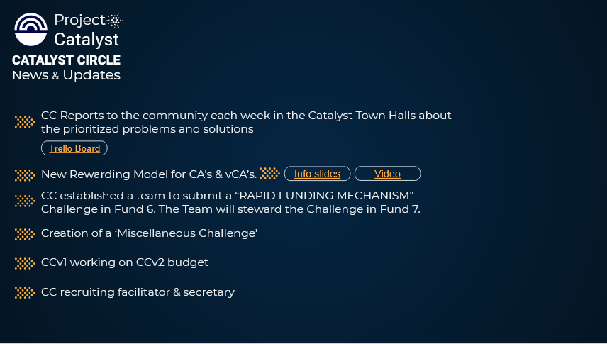
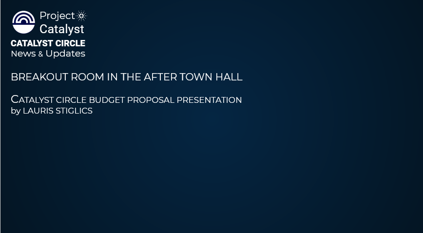

# News & Updates from your representatives

## 1st September 2021, Catalyst Town Hall

### CC Reports to the community each week in the Catalyst Town Halls about the prioritized problems and solutions



Further details in [Catalyst Prioritized Problems Trello](https://catalyst-swarm.gitbook.io/catalyst-circle/activities/catalyst-prioritized-problems-trello)

### New Rewarding Model for CA’s & vCA’s.

Further details in [CA & vCA Rewarding Model - Project Catalyst Fund 6](https://catalyst-swarm.gitbook.io/catalyst-circle/community-advisors/community-advisor-activity#27th-august-2021-ca-and-vca-rewarding-model-project-catalyst-fund-6)

### CC established a team to submit a “RAPID FUNDING MECHANISM” Challenge in Fund 6. The Team will steward the Challenge in Fund 7.

### Creation of a ‘Miscellaneous Challenge’

### CCv1 working on CCv2 budget

### CC recruiting facilitator & secretary

Further details in [Catalyst Circle is looking for an secretary](https://catalyst-swarm.gitbook.io/catalyst-circle/activities/resourcing#catalyst-circle-is-looking-for-an-secretary)

### Source



