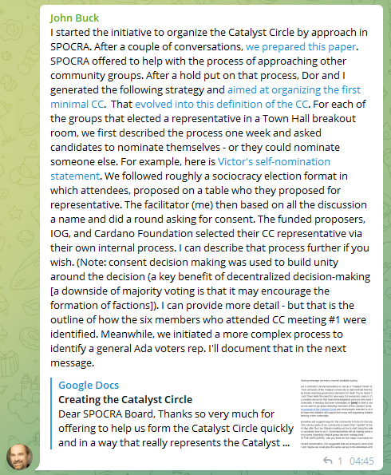
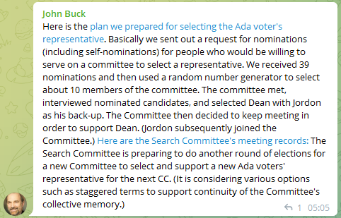
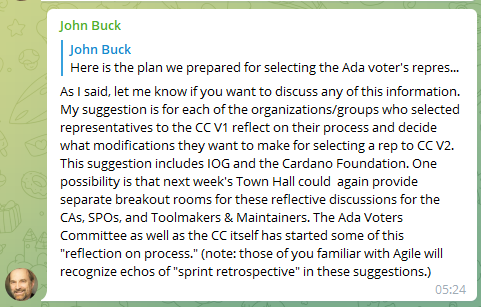

# Background

## John Buck on the formation of CC V1

### Part 1

#### Transcription

I started the initiative to organize the Catalyst Circle by approach in SPOCRA. After a couple of conversations, we prepared this paper :



SPOCRA offered to help with the process of approaching other community groups. After a hold put on that process, Dor and I generated the following strategy and aimed at organizing the first minimal CC : 



That evolved into this definition of the CC :



For each of the groups that elected a representative in a Town Hall breakout room, we first described the process one week and asked candidates to nominate themselves - or they could nominate someone else. 

For example, here is Victor's self-nomination statement



We followed roughly a sociocracy election format in which attendees, proposed on a table who they proposed for representative. The facilitator (me) then based on all the discussion a name and did a round asking for consent. The funded proposers, IOG, and Cardano Foundation selected their CC representative via their own internal process. I can describe that process further if you wish. (Note: consent decision making was used to build unity around the decision (a key benefit of decentralized decision-making \[a downside of majority voting is that it may encourage the formation of factions]). I can provide more detail - but that is the outline of how the six members who attended CC meeting #1 were identified. Meanwhile, we initiated a more complex process to identify a general Ada voters rep. I'll document that in the next message.

### Part 2

Here is the plan we prepared for selecting the Ada voter's representative 

[https://docs.google.com/document/d/1Bv_rBFJYnzMxI1FuoyH_WMUefdmkdqK9cCgqkQpXE2Y/edit?usp=sharing](https://docs.google.com/document/d/1Bv_rBFJYnzMxI1FuoyH_WMUefdmkdqK9cCgqkQpXE2Y/edit?usp=sharing)

Basically we sent out a request for nominations (including self-nominations) for people who would be willing to serve on a committee to select a representative. We received 39 nominations and then used a random number generator to select about 10 members of the committee. The committee met, interviewed nominated candidates, and selected Dean with Jordon as his back-up. The Committee then decided to keep meeting in order to support Dean. (Jordon subsequently joined the Committee.) 

Here are the Search Committee's meeting records: 



The Search Committee is preparing to do another round of elections for a new Committee to select and support a new Ada voters' representative for the next CC. (It is considering various options such as staggered terms to support continuity of the Committee's collective memory.)

### Part 3

As I said, let me know if you want to discuss any of this information. My suggestion is for each of the organizations/groups who selected representatives to the CC V1 reflect on their process and decide what modifications they want to make for selecting a rep to CC V2. This suggestion includes IOG and the Cardano Foundation. One possibility is that next week's Town Hall could again provide separate breakout rooms for these reflective discussions for the CAs, SPOs, and Toolmakers & Maintainers. The Ada Voters Committee as well as the CC itself has started some of this "reflection on process." (note: those of you familiar with Agile will recognize echos of "sprint retrospective" in these suggestions.)

