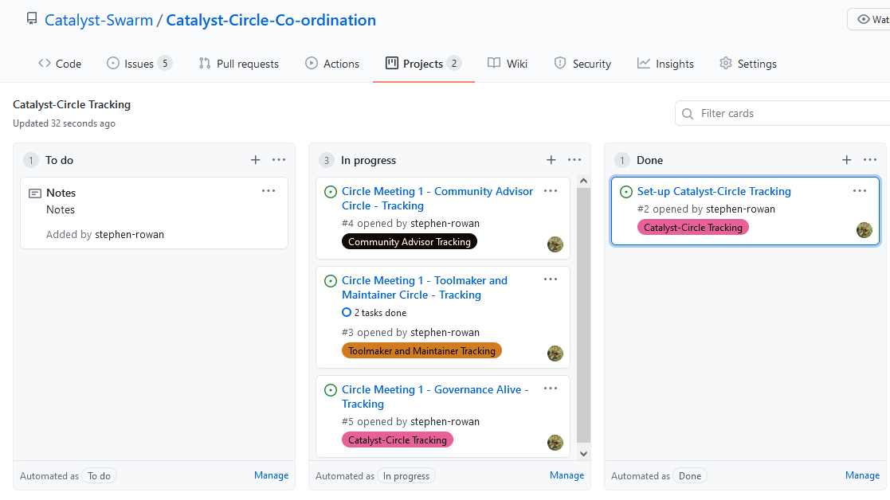

# Catalyst Circle Tracking

In order to provide complete transparency the activities of the Catalyst Circle can now be tracked by Catalyst Community GitHub maintainers. This is meant to provide oversight on the Catalyst Circle and its processes only.

## Catalyst-Circle Tracking - Project Board

Every Catalyst-Circle event will be raised as a GitHub Issue and placed in the [Catalyst-Circle Tracking Project Board](https://github.com/Catalyst-Swarm/Catalyst-Circle-Co-ordination/projects/2).

## Catalyst-Circle event 

Catalyst-Circle events are grouped by Circle Meeting and Circle Representative. For example the Circle Meeting 1 has the following events ...

### Circle Meeting 1 - Community Advisor Circle - Tracking

Which tracks the activities of the Community Advisor Circle for Meeting 1.



### Circle Meeting 1 - Toolmaker and Maintainer Circle - Tracking

Which tracks the activities of the Toolmaker and Maintainer Circle for Meeting 1.



### Circle Meeting 1 - Governance Alive - Tracking

Which tracks the activities of Governance Alive for Meeting 1.



