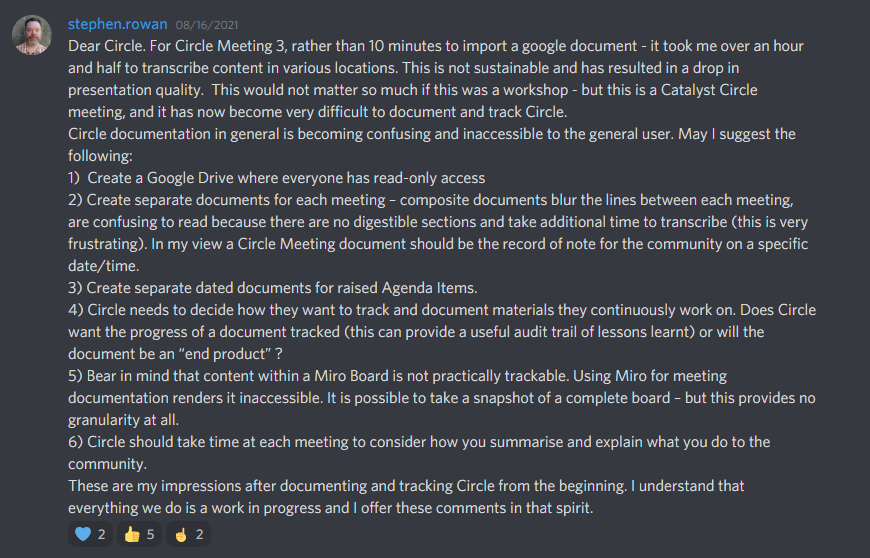
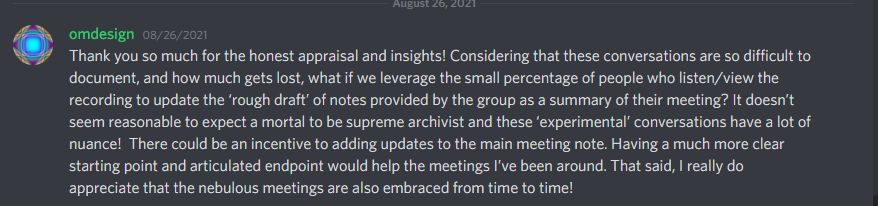
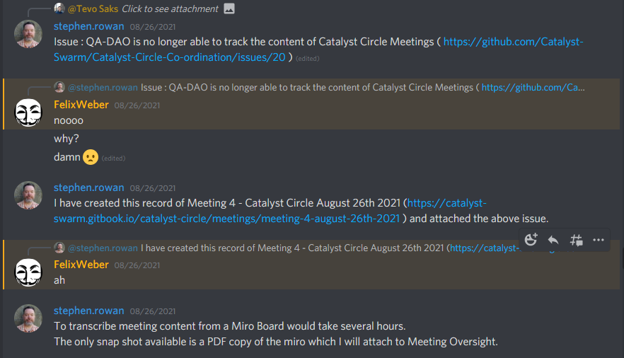
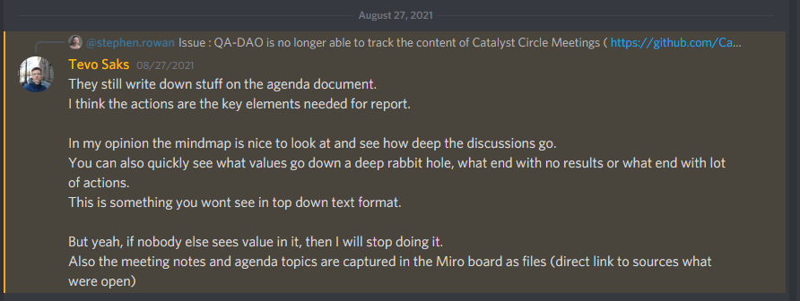
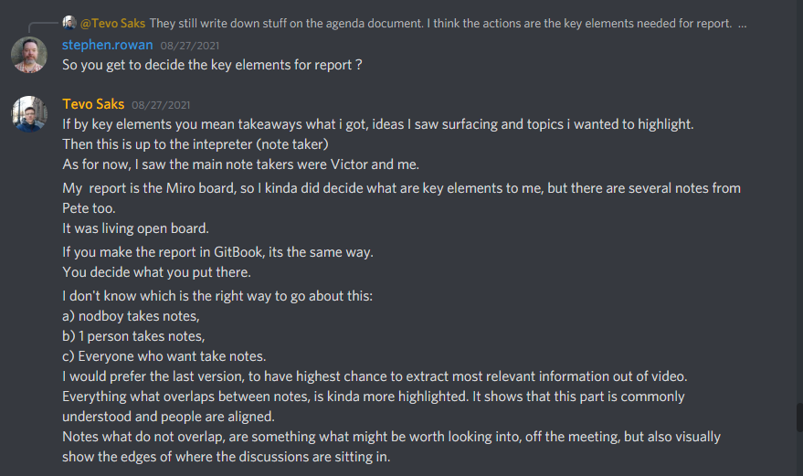
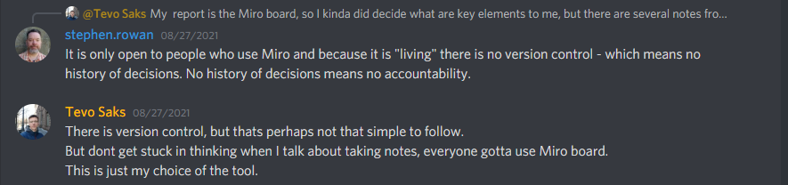

# Commentary on Catalyst Circle

## August 2021

### 16th August 2021

#### Transcription

#### stephen.rowan — 08/16/2021

Dear Circle. For Circle Meeting 3, rather than 10 minutes to import a google document - it took me over an hour and half to transcribe content in various locations. This is not sustainable and has resulted in a drop in presentation quality. This would not matter so much if this was a workshop - but this is a Catalyst Circle meeting, and it has now become very difficult to document and track Circle. Circle documentation in general is becoming confusing and inaccessible to the general user. May I suggest the following: 

1\) Create a Google Drive where everyone has read-only access 

2\) Create separate documents for each meeting – composite documents blur the lines between each meeting, are confusing to read because there are no digestible sections and take additional time to transcribe \(this is very frustrating\). In my view a Circle Meeting document should be the record of note for the community on a specific date/time. 

3\) Create separate dated documents for raised Agenda Items. 

4\) Circle needs to decide how they want to track and document materials they continuously work on. Does Circle want the progress of a document tracked \(this can provide a useful audit trail of lessons learnt\) or will the document be an “end product” ? 

5\) Bear in mind that content within a Miro Board is not practically trackable. Using Miro for meeting documentation renders it inaccessible. It is possible to take a snapshot of a complete board – but this provides no granularity at all. 

6\) Circle should take time at each meeting to consider how you summarise and explain what you do to the community. These are my impressions after documenting and tracking Circle from the beginning. I understand that everything we do is a work in progress and I offer these comments in that spirit.

#### Ideascale context



### 26th August 2021

#### omdesign — 08/26/2021 

Thank you so much for the honest appraisal and insights! Considering that these conversations are so difficult to document, and how much gets lost, what if we leverage the small percentage of people who listen/view the recording to update the ‘rough draft’ of notes provided by the group as a summary of their meeting? It doesn’t seem reasonable to expect a mortal to be supreme archivist and these ‘experimental’ conversations have a lot of nuance! There could be an incentive to adding updates to the main meeting note. Having a much more clear starting point and articulated endpoint would help the meetings I’ve been around. That said, I really do appreciate that the nebulous meetings are also embraced from time to time!

#### Discord context



#### stephen.rowan — 08/26/2021

Issue : QA-DAO is no longer able to track the content of Catalyst Circle Meetings \( [https://github.com/Catalyst-Swarm/Catalyst-Circle-Co-ordination/issues/20](https://github.com/Catalyst-Swarm/Catalyst-Circle-Co-ordination/issues/20) \)

#### Discord context



### 27th August 2021

#### Tevo Saks — 08/27/2021 

They still write down stuff on the agenda document. I think the actions are the key elements needed for report.

In my opinion the mindmap is nice to look at and see how deep the discussions go. You can also quickly see what values go down a deep rabbit hole, what end with no results or what end with lot of actions. This is something you wont see in top down text format.

But yeah, if nobody else sees value in it, then I will stop doing it. Also the meeting notes and agenda topics are captured in the Miro board as files \(direct link to sources what were open\).

#### Ideascale context



#### stephen.rowan — 08/27/2021

So you get to decide the key elements for report ?

#### Tevo Saks — 08/27/2021 

If by key elements you mean takeaways what i got, ideas I saw surfacing and topics i wanted to highlight. 

Then this is up to the intepreter \(note taker\) As for now, I saw the main note takers were Victor and me. 

My report is the Miro board, so I kinda did decide what are key elements to me, but there are several notes from Pete too. It was living open board. If you make the report in GitBook, its the same way. You decide what you put there. 

I don't know which is the right way to go about this: a\) nodboy takes notes, b\) 1 person takes notes, c\) Everyone who want take notes. 

I would prefer the last version, to have highest chance to extract most relevant information out of video. Everything what overlaps between notes, is kinda more highlighted. It shows that this part is commonly understood and people are aligned. 

Notes what do not overlap, are something what might be worth looking into, off the meeting, but also visually show the edges of where the discussions are sitting in.

#### Discord Context



#### stephen.rowan — 08/27/2021 

It is only open to people who use Miro and because it is "living" there is no version control - which means no history of decisions. No history of decisions means no accountability.

#### Tevo Saks — 08/27/2021 

There is version control, but thats perhaps not that simple to follow. But dont get stuck in thinking when I talk about taking notes, everyone gotta use Miro board. This is just my choice of the tool.

