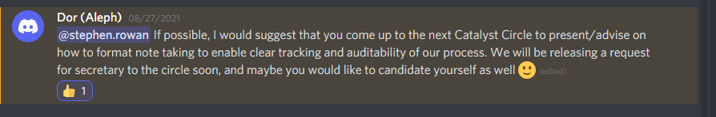

# Commentary on Catalyst Circle

## August 2021

### 16th August 2021

#### Transcription

#### stephen.rowan — 08/16/2021

Dear Circle. For Circle Meeting 3, rather than 10 minutes to import a google document - it took me over an hour and half to transcribe content in various locations. This is not sustainable and has resulted in a drop in presentation quality. This would not matter so much if this was a workshop - but this is a Catalyst Circle meeting, and it has now become very difficult to document and track Circle. Circle documentation in general is becoming confusing and inaccessible to the general user. May I suggest the following: 

1\) Create a Google Drive where everyone has read-only access 

2\) Create separate documents for each meeting – composite documents blur the lines between each meeting, are confusing to read because there are no digestible sections and take additional time to transcribe \(this is very frustrating\). In my view a Circle Meeting document should be the record of note for the community on a specific date/time. 

3\) Create separate dated documents for raised Agenda Items. 

4\) Circle needs to decide how they want to track and document materials they continuously work on. Does Circle want the progress of a document tracked \(this can provide a useful audit trail of lessons learnt\) or will the document be an “end product” ? 

5\) Bear in mind that content within a Miro Board is not practically trackable. Using Miro for meeting documentation renders it inaccessible. It is possible to take a snapshot of a complete board – but this provides no granularity at all. 

6\) Circle should take time at each meeting to consider how you summarise and explain what you do to the community. These are my impressions after documenting and tracking Circle from the beginning. I understand that everything we do is a work in progress and I offer these comments in that spirit.

#### Ideascale context



### 26th August 2021

#### omdesign — 08/26/2021 

Thank you so much for the honest appraisal and insights! Considering that these conversations are so difficult to document, and how much gets lost, what if we leverage the small percentage of people who listen/view the recording to update the ‘rough draft’ of notes provided by the group as a summary of their meeting? It doesn’t seem reasonable to expect a mortal to be supreme archivist and these ‘experimental’ conversations have a lot of nuance! There could be an incentive to adding updates to the main meeting note. Having a much more clear starting point and articulated endpoint would help the meetings I’ve been around. That said, I really do appreciate that the nebulous meetings are also embraced from time to time!

#### Discord context



#### stephen.rowan — 08/26/2021

Issue : QA-DAO is no longer able to track the content of Catalyst Circle Meetings \( [https://github.com/Catalyst-Swarm/Catalyst-Circle-Co-ordination/issues/20](https://github.com/Catalyst-Swarm/Catalyst-Circle-Co-ordination/issues/20) \)

#### Discord context



### 27th August 2021

#### Tevo Saks — 08/27/2021 

They still write down stuff on the agenda document. I think the actions are the key elements needed for report.

In my opinion the mindmap is nice to look at and see how deep the discussions go. You can also quickly see what values go down a deep rabbit hole, what end with no results or what end with lot of actions. This is something you wont see in top down text format.

But yeah, if nobody else sees value in it, then I will stop doing it. Also the meeting notes and agenda topics are captured in the Miro board as files \(direct link to sources what were open\).

#### Ideascale context



#### stephen.rowan — 08/27/2021

So you get to decide the key elements for report ?

#### Tevo Saks — 08/27/2021 

If by key elements you mean takeaways what i got, ideas I saw surfacing and topics i wanted to highlight. 

Then this is up to the intepreter \(note taker\) As for now, I saw the main note takers were Victor and me. 

My report is the Miro board, so I kinda did decide what are key elements to me, but there are several notes from Pete too. It was living open board. If you make the report in GitBook, its the same way. You decide what you put there. 

I don't know which is the right way to go about this: a\) nodboy takes notes, b\) 1 person takes notes, c\) Everyone who want take notes. 

I would prefer the last version, to have highest chance to extract most relevant information out of video. Everything what overlaps between notes, is kinda more highlighted. It shows that this part is commonly understood and people are aligned. 

Notes what do not overlap, are something what might be worth looking into, off the meeting, but also visually show the edges of where the discussions are sitting in.

#### Discord Context



#### stephen.rowan — 08/27/2021 

It is only open to people who use Miro and because it is "living" there is no version control - which means no history of decisions. No history of decisions means no accountability.

#### Tevo Saks — 08/27/2021 

There is version control, but thats perhaps not that simple to follow. But dont get stuck in thinking when I talk about taking notes, everyone gotta use Miro board. This is just my choice of the tool.

#### stephen.rowan — 08/27/2021 

What constituency is this poll addressing? Is it representative of everyone Circle is trying to reach?

#### stephen.rowan — 08/27/2021 

I do not decide what I put in the GitBook - I transcribe everything that can be transcribed. 

#### Tevo Saks — 08/27/2021 

Poll is something personal I want to know. If nobody finds value on these notes on Miro then, I will focus my time somewhere else where I do have value Gotta understand this Miro thing is totally experimental and not a mandatory piece at all. There was idea floating around that circle looking for more note takers and I was happy to show up. With the condition that I use Miro

#### stephen.rowan — 08/27/2021 

When it is being used as the main form of note taking - it is, in effect, mandatory to the general user. 

#### Tevo Saks — 08/27/2021 

Well, alternative is. no note taking at all. And again to me the document where the agenda lives, did collect several notes from meeting.

#### stephen.rowan — 08/27/2021 

Not about the value of what we do Tevo - these comments are more directed at Circle. 

#### stephen.rowan — 08/27/2021 

I will have another look at the materials and try to figure out a way to transcribe that is not so time-consuming. 

#### Tevo Saks — 08/27/2021 

Ok, missunderstood you, though you had problem that I took notes on Miro, but you were actually trying to point out the problem that Circle work is hard to transcribe.

Another thing, the voting I created is still related about the Miro itself and the note taking process. This feedback can be used to analyze if this kind of method has any value at this stage.

#### stephen.rowan — 08/27/2021 

Its more about having what was said and decided in a plain text format that can be version controlled and saved to an open-source location. In this way I can track Circle decisions and discussions. In short, the decision-making process. So that Circle is accountable for its decisions and how it reaches its decisions is transparent and accessible. Accessibility is the key here - because Circle wants to be a “human sensor array” that " outputs a transparent view into the hopes, wants, needs and concerns of the community" - I hold it to this standard. One of Circles main responsibilities is that "output" - e.g., communicating to as wide an audience as possible. How Circle decides to experiment internally itself with its decision-making process should be balanced with how effectively it communicates externally what it does.

#### Tevo Saks — 08/27/2021 

I think the transparency and impact of decision making is more clear when you look at the Trello board. And again action decision were recorded in the Open Agenda document. \(or as the purple stickies on miro, although i might not got all of them\) So in my opinion your concerns are addressed in a way that they are accessible and transparent 

#### stephen.rowan — 08/27/2021 

I disagree. I think Circle is failing to communicate what it does to the general user. 

#### stephen.rowan — 08/27/2021 

What is palatable to a general user is a plain text overview of what Circle has decided/discussed. With the option to drill down without having to access or have knowledge of proprietary systems.

#### Tevo Saks — 08/27/2021 

Well, I see problem here. Would that fit into one of your existing proposals? To get funding to solve this issue as like audit requirements or something 

#### stephen.rowan — 08/27/2021 

Yes I do have a proposal in draft - F6: Distributed decision making - Oversight of Catalyst Circle - [https://cardano.ideascale.com/a/dtd/Oversight-of-Catalyst-Circle/370088-48088](https://cardano.ideascale.com/a/dtd/Oversight-of-Catalyst-Circle/370088-48088). What I will do is try to work with the current situation and record the additional time it takes me to transcribe content to an open format. I will use the new timeframes to budget my proposal.

#### Dor \(Aleph\) — 08/27/2021 

@stephen.rowan If possible, I would suggest that you come up to the next Catalyst Circle to present/advise on how to format note taking to enable clear tracking and auditability of our process. We will be releasing a request for secretary to the circle soon, and maybe you would like to candidate yourself as well :slight\_smile:

#### FelixWeber — 08/27/2021 

could we speed up the process for the secretary? As stephen is engaging in CC since the beginning, it would be quite fair to just give him the role he picked by himself already and make it official? \( if stephen would like to \). 

#### stephen.rowan — 08/27/2021 

@Dor \(Aleph\) - I will be happy to come to the next Catalyst Circle and discuss/present clear tracking and auditability of the Circle process. I could fulfil a secretary role as long as I can continue to conduct oversight activities. I was also going to include a commentary part to my F6 proposal \(e.g. equivalent to political commentary\) - posting about Circle on Reddit, Social Media etc. This might conflict with a secretary role ? 

#### stephen.rowan — 08/27/2021 

I appreciate your support Felix - but I believe that all roles should follow a due process - so I would prefer to apply in an open process. 

#### FelixWeber — 08/28/2021 

fair enough good soul :slight\_smile:

### 30th August 2021

#### Randall — Yesterday at 5:12 PM 

I wonder if the difference in personal valuation of Miro may have to do with people who benefit from visual/spacial representations and the relationships between notions in the topic-space :man\_raising\_hand: , vs people for whom that presentation creates confusion instead of meaning. I could understand it being super hard to extract notes from Miro, for someone whose mental style is a mismatch 

#### Randall — Yesterday at 5:48 PM 

conversely, plain-text notes are pain-text notes for some of us \(haha\) 

#### FelixWeber — Yesterday at 6:08 PM 

what you would do next to an secretary role shouldnt be decided nor judged in any way by the CC.. even when you would comment critics on the circle :slight\_smile: \( my point of view \) 

#### FelixWeber — Yesterday at 6:10 PM 

Mhh, i think Miro board is great as an interactive tool, but might fail as a documentation tool ? so keeping the meeting notes and minutes on a simple doc might have more value.. what do you think? 

#### Randall — Yesterday at 6:14 PM 

I think "both" would have more value. 

### 31st August 2021

#### stephen.rowan — Today at 11:13 AM 

I agree that this is not necessarily an either/or issue. The major issue from a communications perspective is accessibility, portability, and open source \(the source is not restricted to a proprietary platform\). There is an outward experimentation requirement: to reach as many people as possible on as many platforms as possible \(we sometimes call this onboarding\). And plain text allows for this. Text is not the interface but the medium of exchange of information. This contrasts and can be in conflict with inward experimentation on a specific platform that serves a group's own work \(e.g. Trello, Miro etc\). I see a lot of inward experimentation - but not so much outward experimentation.

