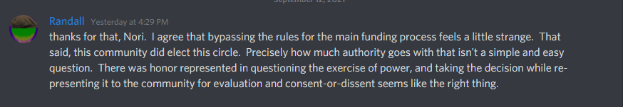
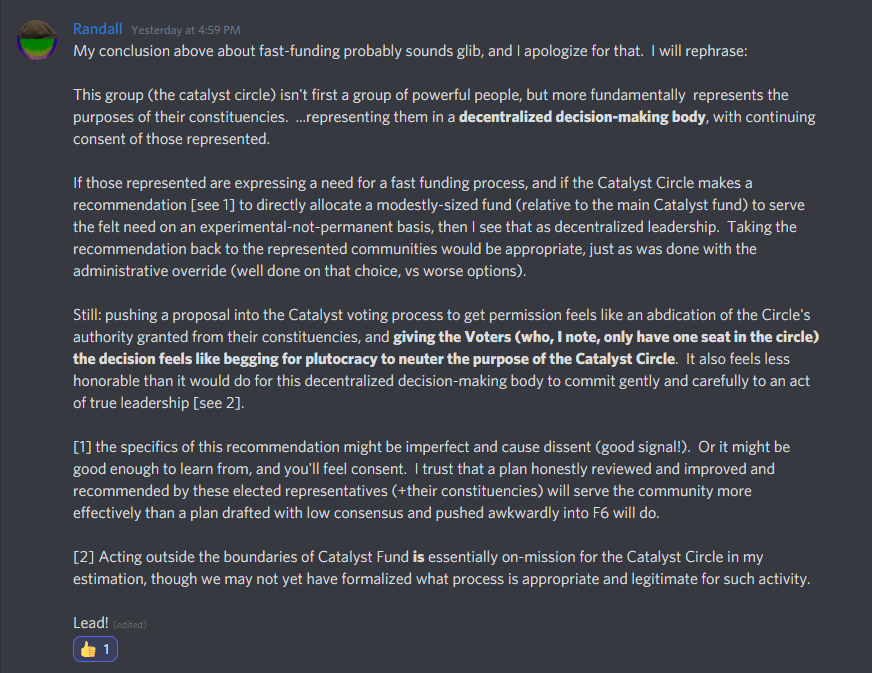

# Meeting 5 - Commentary

## Friday, 10th September, 2021

> FelixWeber — 09/10/2021 - Would love to have some feedback from the community about yesterdays CC meeting \#5 [https://drive.google.com/file/d/1hyNGQ0bRfCo3ezCZumz3hHvheO6DwnUC/view?usp=sharing](https://drive.google.com/file/d/1hyNGQ0bRfCo3ezCZumz3hHvheO6DwnUC/view?usp=sharing) Was a quite difficult and emotional meeting for all CC members and we would really really love your feedback

#### Discord context



> Randall — 09/10/2021 - What I got at a summary level is that the fast-funding proposal highlighted more pain-points than just speed \(good info!\), but \(red flag\) veered from its core mission to enable high-importance projects to drive forward decisively. And some commitments from circle members were not met.
>
> And under-resourcing in circle remains a recognized problem; that the community doesn't care much for spending time rehashing that issue, but that doesn't make it not a problem. On this, my POV is that if the circle is to have responsibility without resourcing, that would be a sham construct. If it does have a mission and authority as I understand to be the real intent, I believe it should do what is needed, notify IOG and CF and community of the consented mandate, and get'er done.\[8:22 PM\]
>
> Chaining onto the latter point:
>
> On fast-funding, I find it completely ridiculous that the circle should go to a slow funding process to get consent to enable a fast funding process. I understand, but simply disagree. Asking CF and IOG for e.g. 100k ADA from the treasury, with proposals arriving into circle delegates from their respective membership, and having the circle's consent for those initiatives, would make more sense to me.
>
> Randall — 09/10/2021 - hope I'm not way off on my understanding here : \)

#### Discord context



## Saturday, 11th September, 2021

> Nori — 09/11/2021 I started writing down my thoughts, and it turned out to be much too long for a post on Discord \(apparently there is a 2000 character limit!\), so here is a PDF of the thoughts that I made based on watching the meeting.

### Nori - Catalyst Circle \#5 - Meeting Thoughts

PDF uploaded here : [https://github.com/Catalyst-Swarm/Catalyst-Circle-Co-ordination/blob/main/Documents/Meetings/Meeting-5/Catalyst\_Circle\_5\_-\_Meeting\_Thoughts.pdf](https://github.com/Catalyst-Swarm/Catalyst-Circle-Co-ordination/blob/main/Documents/Meetings/Meeting-5/Catalyst_Circle_5_-_Meeting_Thoughts.pdf)

> Meeting Video referenced here: [https://drive.google.com/file/d/1hyNGQ0bRfCo3ezCZumz3hHvheO6DwnUC/view](https://drive.google.com/file/d/1hyNGQ0bRfCo3ezCZumz3hHvheO6DwnUC/view)
>
> First of all, let me start by saying that I am very grateful that these meetings are recorded and available for the Catalyst community to watch. Thank you to the Circle for maintaining transparency and openness. This meeting covered some difficult emotional and challenging ethical grounds, and I wanted to post some of my thoughts. They are broken down into three large buckets:
>
> 1\) Communication and Expectation Setting
>
> 2\) Volunteerism vs. Paid Professionals
>
> 3\) Invoking Special Privileges
>
> #### Communication and Expectation Setting
>
> It was apparent from the meeting and conversation that the Circle could use more support in capturing action items, reminding people, and following up in-between meetings. There also seemed to be some challenges with expectation setting. Being able to reflect on these and come up with ideas to improve are a great exercise and I am happy to see you all willing to improve things.
>
> One thing that should help \(it's still an experiment, so we'll see! will be the team of facilitators and secretaries that are forming to support the Catalyst Circle. This team of 7 people will be able to act as a team of meeting administrators splitting the duties of facilitation and secretary between two representatives, and the rest of the team assisting in the creation of the next meeting agendas, capturing and disseminating action items, and general meeting hygiene activities and archival recording of notes and recordings.
>
> One area of focus for the Circle can be to set expectations of the roles of each of the Circle members. Is the expectation just to show up at a 2 hour meeting once every two weeks? If not, it would be good to outline the additional expectations and the time that should be required to fulfill these additional requirements. It looks like in your exuberance to make some impact, the Catalyst Circle tried to take on a lot of different initiatives, and perhaps took on more than was healthy for the time available from the members.
>
> #### Volunteerism vs. Paid Professionals
>
> The topic of volunteerism vs. paid professionals is a really great one. The current circle is comprised of volunteers, and desires to transition into paid professionals. This will better justify the time demands of the roles \(see above points\) and set up strong expectations of what success looks like in this role. I think this is a positive direction in which to move to make Catalyst Governance more sustainable over the long term. Volunteerism is a strength in our community, but we also need to be able to set a high bar on these roles and have strong expectations of performance to be successful. Paying people for this performance is more sustainable over the long term as people can stop trying to fit it in between their full-time job and personal life, if they can work for Catalyst part-time or fulltime.
>
> #### Invoking Special Privileges
>
> This was, to me, the most interesting and heartfelt part of the meeting. I found it very reassuring that the ethical and trust issues around invoking special privileges for the Catalyst Circle to get very important proposals into IdeaScale after the deadline were brought up by members of the Circle. When something feels wrong, it should be explored, and I think the discussion comparing the critical need to fund the next Catalyst Circle versus evoking special privileges and losing trust or respect of the community was a great exploration of why it felt wrong, and getting to consensus on a path, even if it did not feel completely great at the end. The fact that the discussion happened and that people were able to voice concerns, discuss it, and then share that conversation in all its awkward emotional glory with the community was in itself trust-building, transparent, and open. I wasn't there, so I can't say for sure how I would have handled it, but I respect the conversation and willingness of people to step up and say "wait a second, this feels wrong, we need to talk about it.".

> Randall — 09/12/2021 - thanks for that, Nori. I agree that bypassing the rules for the main funding process feels a little strange. That said, this community did elect this circle. Precisely how much authority goes with that isn't a simple and easy question. There was honor represented in questioning the exercise of power, and taking the decision while re-presenting it to the community for evaluation and consent-or-dissent seems like the right thing.

> Randall — 09/12/2021 - My conclusion above about fast-funding probably sounds glib, and I apologize for that. I will rephrase:
>
>  This group \(the catalyst circle\) isn't first a group of powerful people, but more fundamentally represents the purposes of their constituencies. ...representing them in a **decentralized decision-making body**, with continuing consent of those represented. 
>
> If those represented are expressing a need for a fast funding process, and if the Catalyst Circle makes a recommendation \[see 1\] to directly allocate a modestly-sized fund \(relative to the main Catalyst fund\) to serve the felt need on an experimental-not-permanent basis, then I see that as decentralized leadership. Taking the recommendation back to the represented communities would be appropriate, just as was done with the administrative override \(well done on that choice, vs worse options\). 
>
> Still: pushing a proposal into the Catalyst voting process to get permission feels like an abdication of the Circle's authority granted from their constituencies, and **giving the Voters \(who, I note, only have one seat in the circle\) the decision feels like begging for plutocracy to neuter the purpose of the Catalyst Circle**. It also feels less honorable than it would do for this decentralized decision-making body to commit gently and carefully to an act of true leadership \[see 2\]. 
>
> \[1\] the specifics of this recommendation might be imperfect and cause dissent \(good signal!\). Or it might be good enough to learn from, and you'll feel consent. I trust that a plan honestly reviewed and improved and recommended by these elected representatives \(+their constituencies\) will serve the community more effectively than a plan drafted with low consensus and pushed awkwardly into F6 will do.  
>  
>
> \[2\] Acting outside the boundaries of Catalyst Fund **is** essentially on-mission for the Catalyst Circle in my estimation, though we may not yet have formalized what process is appropriate and legitimate for such activity. Lead!\(edited\)1

