# Community Advisor Circle Activity

## 23rd July 2021

### The problem sensing phase about Catalyst from the CAs perspective has just ended. 

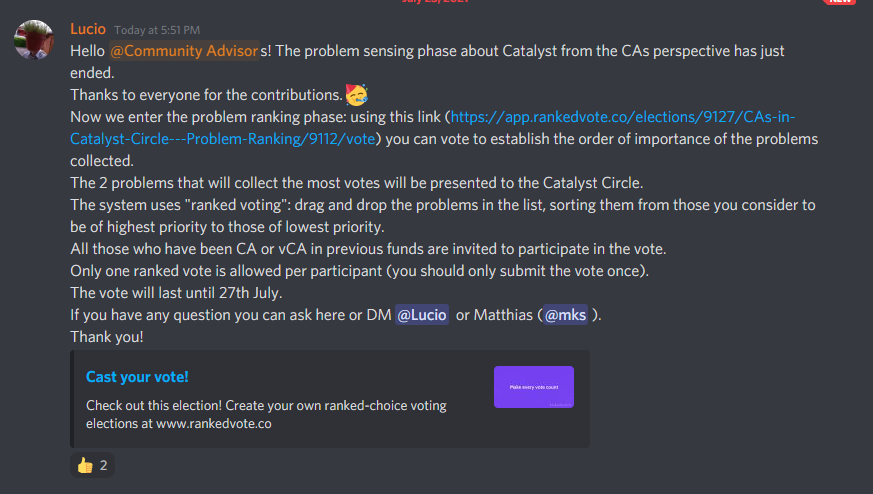

#### Discord Context



### Rank your vote

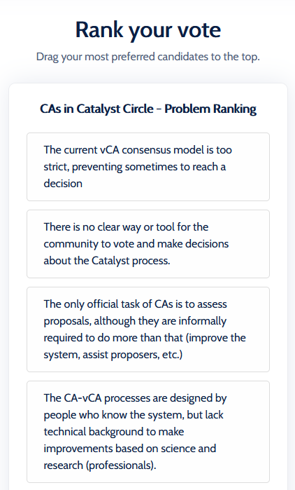

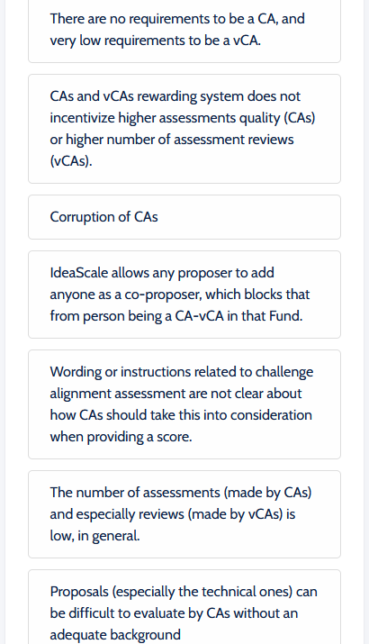

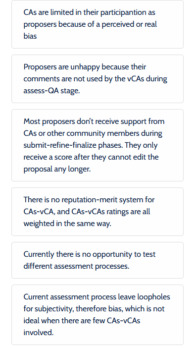

## 28th July 2021

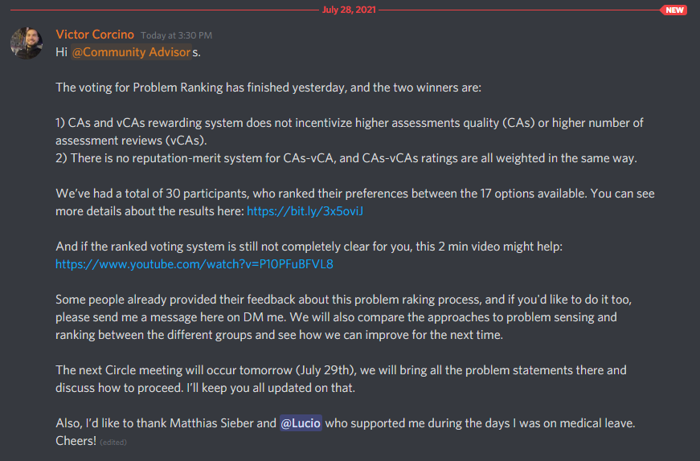

### Ranked Voting

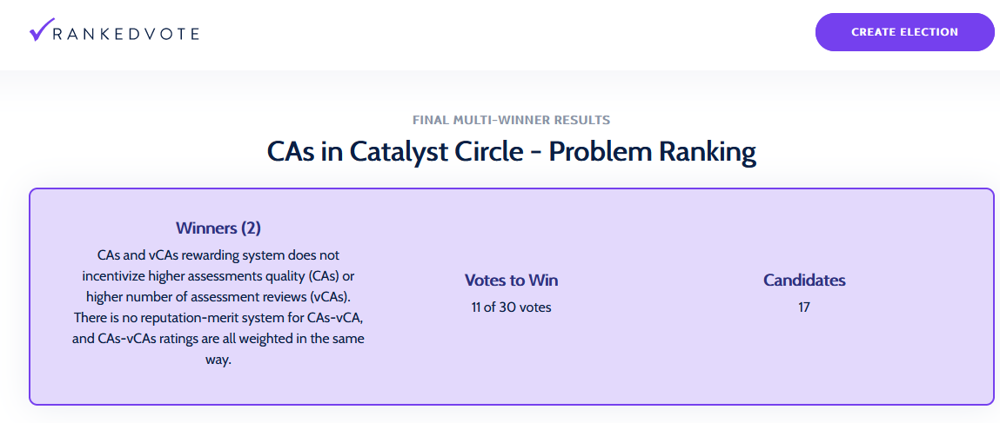

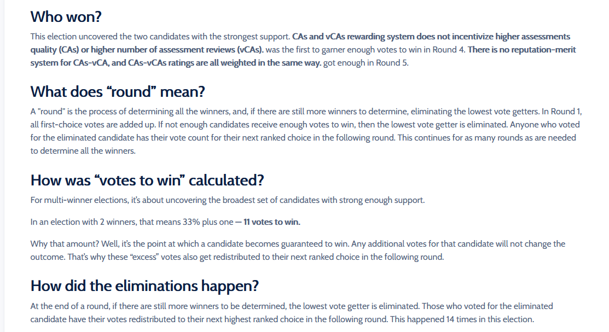

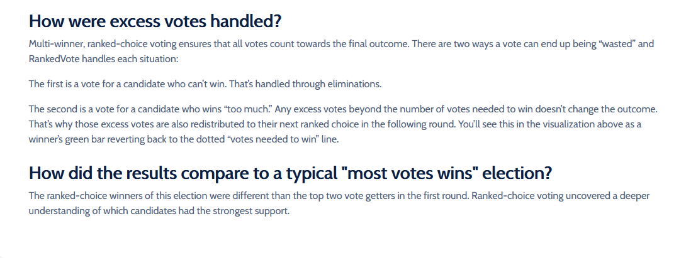

### Round 1

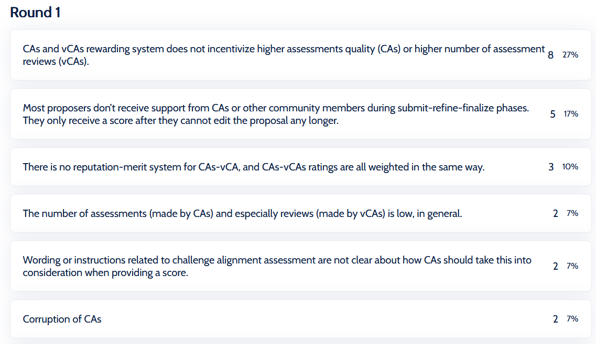

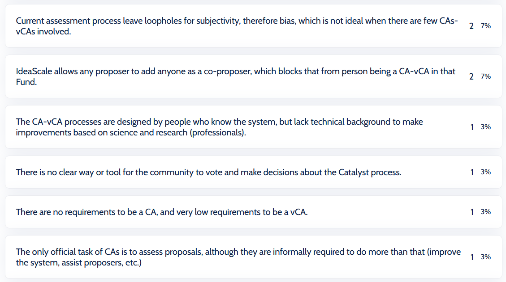

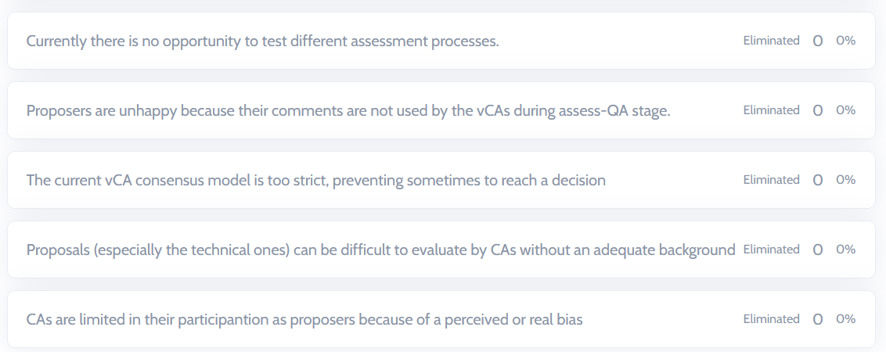

### Round 2

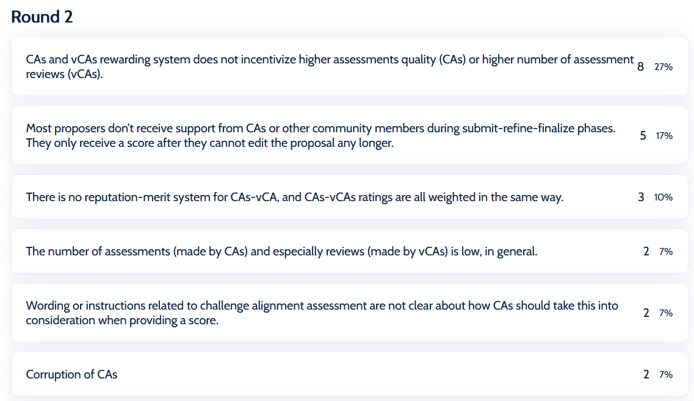

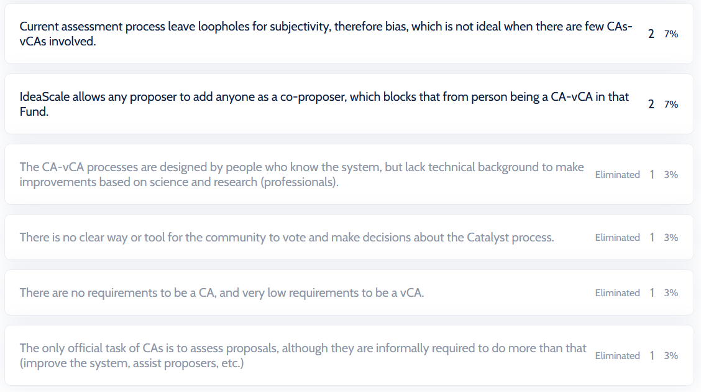

### Round 3

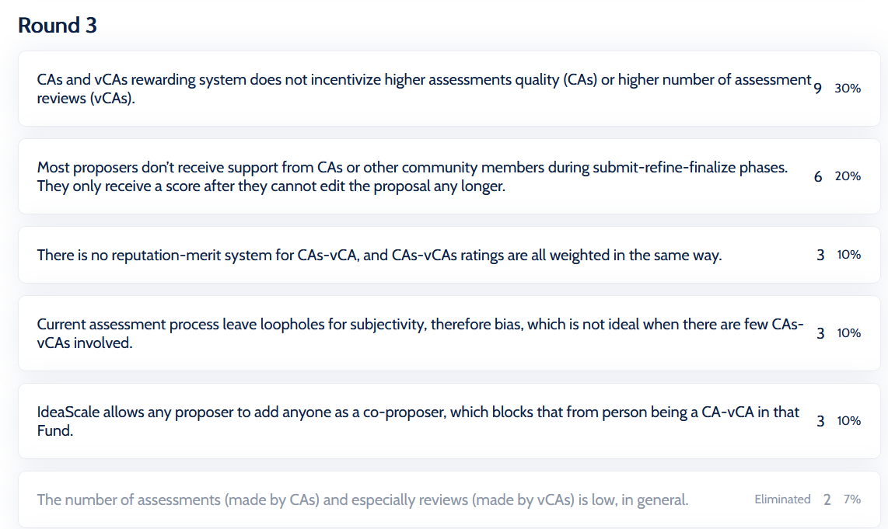

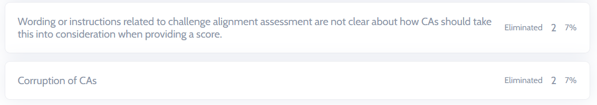

### Round 4

### Round 5

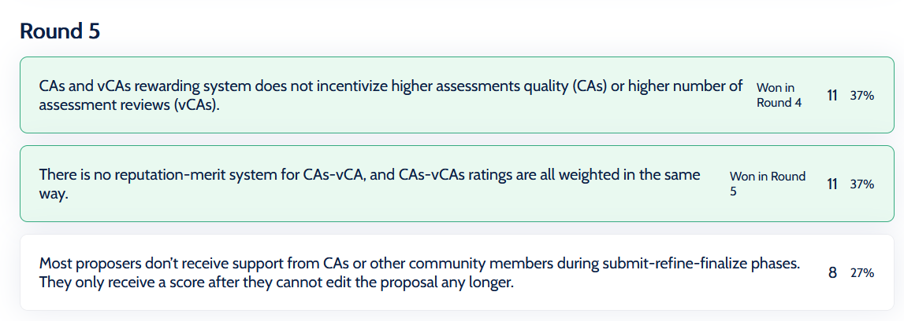

### Ranked Choice Voting!?! Here's How it Works



