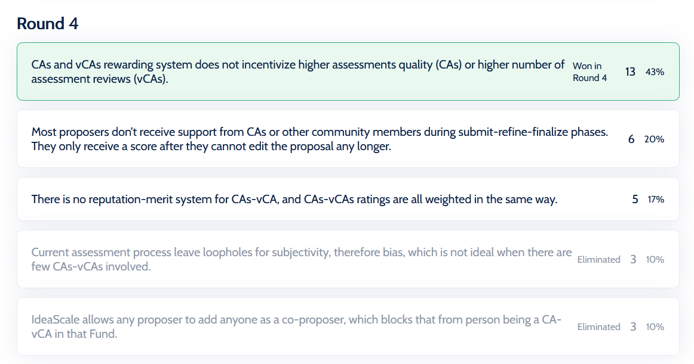

# Community Advisor Circle Activity

## 23rd July 2021

### The problem sensing phase about Catalyst from the CAs perspective has just ended. 

#### Discord Context



### Rank your vote

## 28th July 2021

### Ranked Voting

### Round 1

### Round 2

### Round 3

### Round 4

### Round 5

### Ranked Choice Voting!?! Here's How it Works



