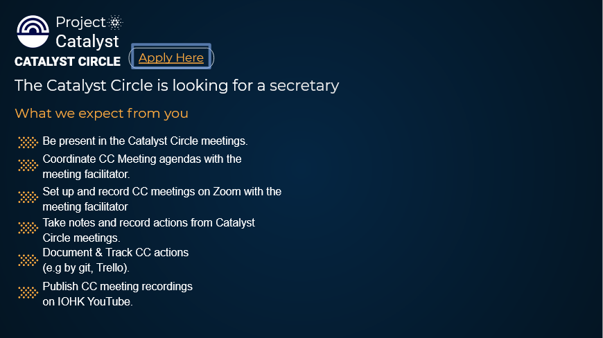

# Resourcing

## Catalyst Circle is looking for an meeting facilitator 

At the Catalyst Town Hall of 25th August 2021, Catalyst Circle posted a slide "for an meeting facilitator to support the Catalyst Circle in the meetings".

### Tracking



### Transcription

The Catalyst Circle is looking for an meeting facilitator to support the Catalyst Circle in the meetings

What we can expect from you

being present in the Catalyst Circle meetings

involving everyone in the discussion

steering focus and activity

capturing action items

### Google Form Application

### Transcription

Catalyst Circle Facilitator Hello there

The Catalyst Circle is looking for an meeting facilitator to support and help the Catalyst Circle in his meetings. What we would expect for you

You should be a calm and objective person, able to steer conversations in an inclusive and productive way without taking to much control of the conversation.

Further, you should be able to

* being present in all the Catalyst Circle meetings, hich take place each two weeks
* involve everybody in the discussion
* steer focus and activity
* capturing action items
* support the Catalyst Circle in defining Agenda items for the next meeting\(s\)

If you are ready to begin this journey, complete the application form to join the Challenge Team and be welcomed as a candidate. We are looking forward to meeting you!

Your Catalyst Circle

## Catalyst Circle is looking for an secretary

At the Catalyst Town Hall of 1st September 2021, Catalyst Circle posted a slide "Catalyst Circle is looking for an secretary".

### Tracking



### Google Form Application

### Transcription

Catalyst Circle - Secretary Hello there

The Catalyst Circle is looking for an secretary to support and help the Catalyst Circle in his functionality. What we would expect for you:

* being present in all the Catalyst Circle meetings, which take place each two weeks
* Coordinate CC Meeting agendas with the meeting facilitator.
* Set up and record CC meetings on Zoom with the meeting facilitator
* Take notes and record actions from Catalyst Circle meetings.
* Document & Track CC actions \(e.g by git, Trello\).
* Publish CC meeting recordings on IOHK YouTube

If you are ready to begin this journey, complete the application form to join the Challenge Team and be welcomed as a candidate. We are looking forward to meeting you!

Your Catalyst Circle

