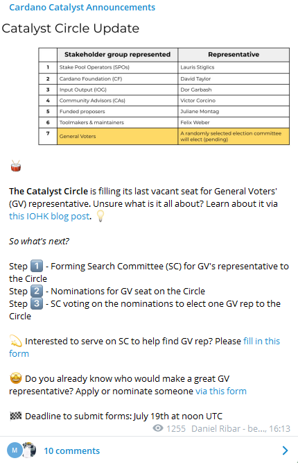
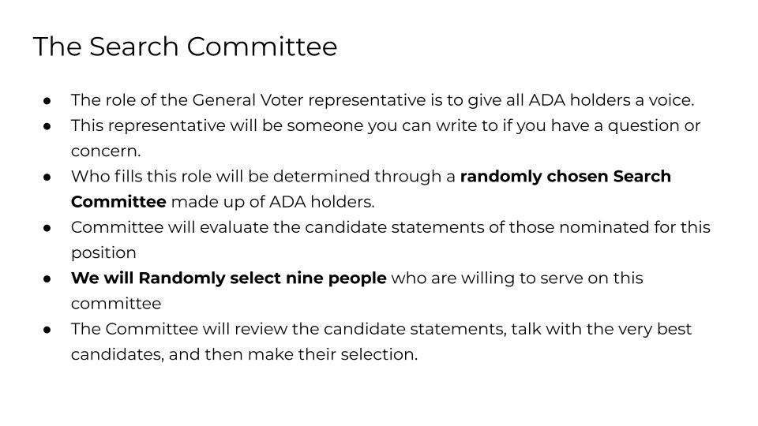
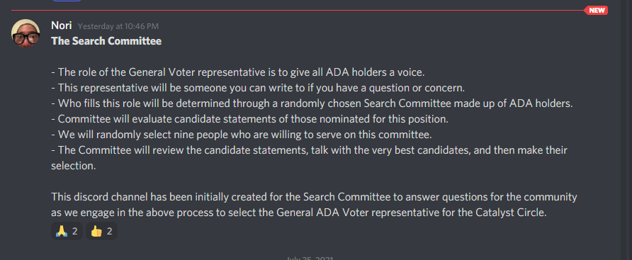
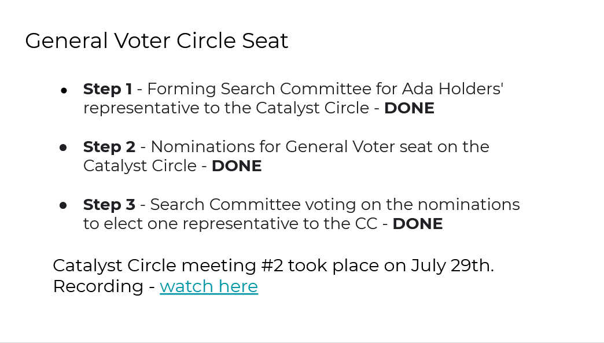
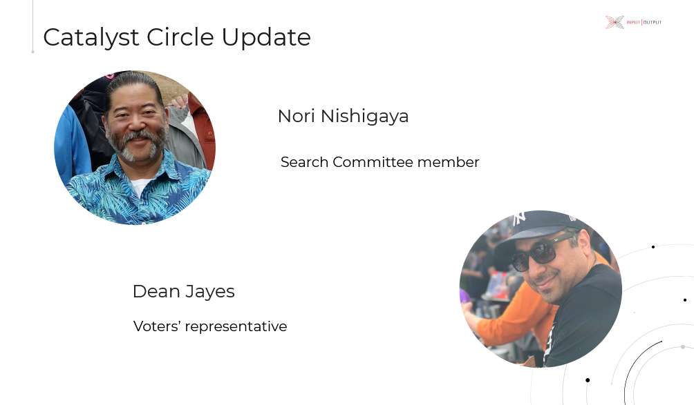
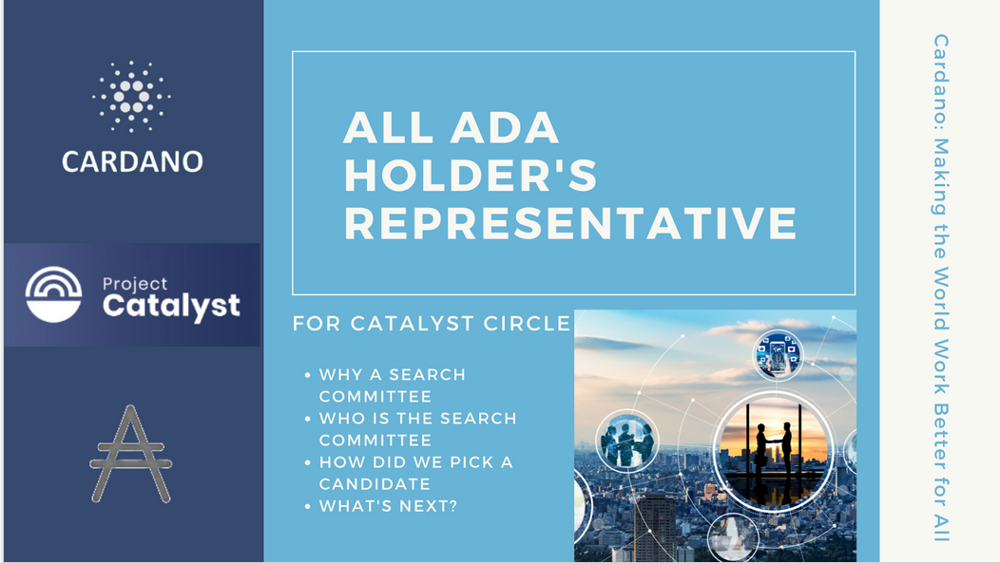
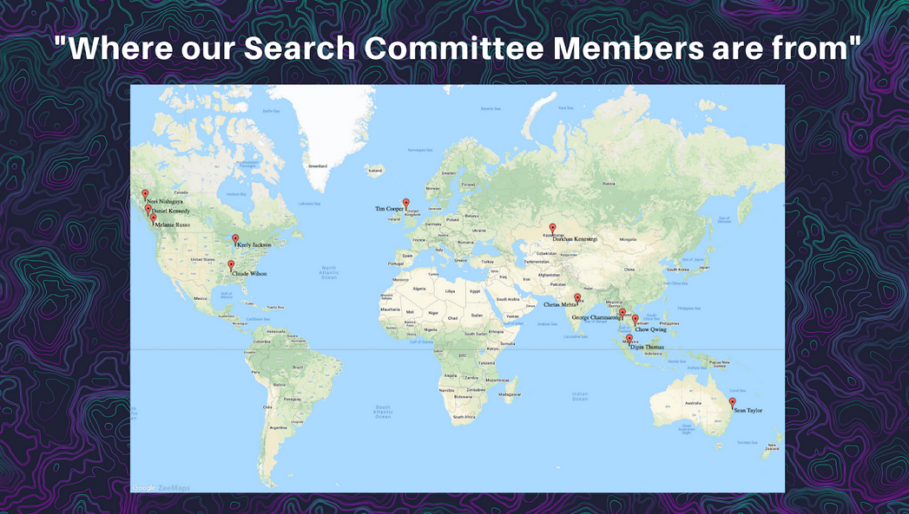

# General Voters Circle Activity

## The Catalyst Circle is filling its last vacant seat

Telegram Link



The Catalyst Circle is filling its last vacant seat for General Voters' \(GV\) representative.

## Agenda/notes Search Committee - July 2021



## Transcription

Link to meeting: [https://us02web.zoom.us/j/745249345?pwd=RVZST0pzeCtWdCtUdFU3NnAzb2o5QT09](https://us02web.zoom.us/j/745249345?pwd=RVZST0pzeCtWdCtUdFU3NnAzb2o5QT09)

## July 26th, 2021, at 14:00 - 15:30 UTC

Members: Members: Tim Cooper, Dipan Thomas, Keely Jackson, Chow Qwing, Nori Nishigaya, Sean Taylor, Chetas Mehta, Darkhan Kenestegi, Daniel Kennedy, George Lerner, Melanie Russo, John Buck, Pete Oliver-Kreuger

Check-in \(start 0:00\)

Accept proposed Content Agenda \(start 0:05\)

Content Agenda

* Interviews - see [listing in spreadsheet for more detail](https://docs.google.com/spreadsheets/d/1e4E4w5cNmiXylUwCiwMXKignvFvxGHBAgTf0JtXijBw/edit?usp=sharing). \(I hid the rows of candidates that did not appear to be really viable - unhide them and look to Column J, Processing Notes, to see rationale.\)
* Here is the interview schedule
  * Yordan Balabanov \(0:10\) \(7/24 - confirmed will attend\)
  * Charles Hoskinson \(0:20\)
  * Mercy \(0:30\) \(7/24 - withdrew\)
  * Chris of Straight Pool \(0:40\) \(7/24 - withdrew\)
  * Dean Jayes \(0:50\) \(7/24 - confirmed will attend\)
* Discussion of next steps \(start 1:00\)
  * Do a round: do we want to select someone \(if so, who?\) now or arrange to talk more in-depth with the top candidates \(who?\)
* Closing round \(rate the productivity of the meeting \[1-5\] in chat; verbal: what went well, what could go better next time?\)

## July 22, 2021, 14:00-15:30 UTC.

Members: Tim Cooper, Dipan Thomas, Keely Jackson, Chow Qwing, Nori Nishigaya, Sean Taylor, Chetas Mehta, Darkhan Kenestegi, Daniel Kennedy, Lyndon Joseph, George Lerner, Melanie Russo, John Buck, Pete Oliver-Kreuger

Check-in \(getting to acquainted\) \(start 0:00\)

Accept proposed Content Agenda \(start 0:15\) - No objections

Content Agenda

* Background/questions regarding the [Catalyst Circle](https://docs.google.com/document/d/1IgyOWMvMEtM0nkrGutN8pgcWa3HtmEwhRZ4ZO-veF5g/edit?usp=sharing) & role of Selection Committee \(0:17\)
  * Clarification: The question raised was whether the person to be selected will represent Ada voters or all Ada holders. The answer is that the person will represent “All Ada Holders”, not just voters.
  * List of other groups represented in the current Catalyst Circle
    * IOG
    * Cardano Foundation
    * Toolmakers & Maintainers
    * Community Advisors
    * Funded Cohort \(Past Fund Winners\)
    * Stakepool Operators

⇒ NOTE: We need to make contact info for CC members available to everyone

* What do we want to be the qualifications/selection criteria for the General Ada Holders’ Representative to the Catalyst Circle? [See table](general-voters-circle-activity.md). \(0:28\)
  * Nori: We have a circle seat to represent Stakepool operators, already represented, so would prefer not to include SPOs.
    * Dipin: Fine with removing SPO as a criteria.
  * Nori: Not sure about the requirement that they run a website.
    * Daniel: Remove website requirement.
  * Darkhan: No remaining objections
  * George: Should describe the objectives that the candidate should fulfill. \(Don’t have to decide today, but should vote on the general goal.\)
    * John: In general, the elected person represents the community using their own good judgement \(not just relaying messages\) plus reporting back on the decisions of the circle and why they went along with the decision.
  * George: Would like to add some metrics, some way to measure their participation.
    * Are they attending meetings?
    * Etc.
  * All consisted with the final, modified, combined list of criteria below.
* List of [confirmed candidates identified so far](https://docs.google.com/spreadsheets/d/1e4E4w5cNmiXylUwCiwMXKignvFvxGHBAgTf0JtXijBw/edit?usp=sharing) and the nomination statements. \(0:40\)
  * Are there other candidates we want to consider?
  * George: Should we elect one person from this Search Committee to share about what happened inside this meeting with the community.
  * Tim: The list is light, and we may have excluded some of these people with the overlaps of SPOs.
  * Dipin: We should give an opportunity to everyone \(who is reachable\) and give them an opportunity to give at least a 5 minute description of themselves.
  * Keely: Don’t enough to pick someone right now, but definitely interview, not just going by what’s written.
  * Nori: Agree that the list is really light. SPO role should not be a requirement, but also should not disqualify a candidate. Nomination form was poorly nominated \(not that we can fix this now\) but many people didn’t know how to put nominations into the process. \(Nori shared that he submitted Merci’s name because he was the one that found the form for nominations, and Merci’s name was chosen in the Swarm.\)
  * Darkhan: Nothing more beyond what has already been added. Thanks to Nori for being transparent.
  * Daniel: Just writing in the form is not enough; some kind of video recording or talk would help people make up their minds.
  * George: This is entirely a volunteer effort. All we should consider is that they have the enthusiasm. Someone with little background can do the job fine. Don’t need the best candidate, just a good candidate.
  * Melanie: A little uncomfortable because not a lot of information, but I like what George is saying, and let’s just run with what we have. Maybe we have just the right people here.
  * Claude: Should the nomination process include a pitch from candidates or a prerequisite of skillsets/accomplishment OR BOTH…
  * Chau: 2-3 minutes final presentation so we can make a selection.
  * John: Proposal: Schedule a meeting early next week
    * Everyone who can come will have a chance to interview
    * If you can prepare a statement ahead of time even better
    * Interviews in the first hour, and then 30 minutes of discussion.
    * Pete: No more than 5 minutes to talk, to allow time for questions, with 10 total minutes per candidate, to get through 6 people in one hour, and leave 30 minutes after interviews for discussion.
    * Nori: Ask why they are interested to get their motivation.

<table>
  <thead>
    <tr>
      <th style="text-align:left">
        <ul>
          <li>Invite all candidates who are interested to attend an interview session
            next week.</li>
          <li>Candidates should present why they want to be elected and share their
            motivation.</li>
          <li>If they cannot attend, they may submit a written statement.</li>
          <li>Each interview candidate is given up to 5 minutes max to present.</li>
          <li>Immediately following each candidate presentation there will be up to
            5 minutes for the selection committee to ask questions of each candidate.</li>
          <li>After all candidates have presented and departed, the selection committee
            will meet afterwards for at least 30 minutes to deliberate.</li>
        </ul>
        
All consented

      </th>
    </tr>
  </thead>
  <tbody></tbody>
</table>

* Given our criteria, who are the top ranked candidates? [See table](general-voters-circle-activity.md). \(0:55\)
* Do we wish to interview the top candidates? \(If yes, who?\) - Schedule possible times/dates to interview\(1:05\)
* \(If not\) select a candidate by consent. \(1:05\)
* Elect someone from this selection committee to answer questions about the selection committee on Discord and elsewhere in the community.
  * Alternatively, there is a [channel in the Discord](https://discord.gg/yQJdQFjy) where we could communicate about the selection process, instead of only having one person to answer questions. We would then all have to monitor the channel and respond.
* We should propose to the Catalyst Circle to reward members of the first Catalyst Circle not with money, but maybe swag or recognition.
* Next meeting: Monday, July 26, 2021 at 14:00 UTC
  * Pete & John need to shift Monday meeting
* We will setup a Telegram channel for communication of this group between meetings
  * Keely: @kjacks
  * Melanie: @MRusso2020
  * Dipin: I will email the handle
  * Nori: @xeeban

Evaluation of the meeting \(1:30\)

* George: 5. Very good meeting.
* Claude: Thanks for the invite and opportunity to help build this AWESOME, Incredible, Unprecedented "THING"...
* Nori: Meeting felt productive and inclusive. Great moderation and participation.
* Keely: I think this was pretty productive for a first meeting. Great input from everyone. Thank you!
* Dipin: 5, very good meeting and productive.
* Darkhan: 5. Good meeting, everything very nice and humble. A little sad with candidates list we have. Hope next rotation will be more people interested\)
* Melanie: 5. good meeting. I am finding my way into the group...

End of meeting \(1:35\)

Action Items:

* Nori: Discord Channel Creation
  * UPDATE:
  * Here is a link to the Cardano Catalyst discord server channel opened up for this group to answer questions posed by the community. It is a public forum alongside the other Catalyst Circle groups.
  * [https://discord.gg/gqsfh34G](https://discord.gg/gqsfh34G)
* John: Share Recording of this meeting
* Daniel: If someone wants to send a message to their rep, how do they do that?
* John: Create Telegram channel for this group.
* John: Propose to Catalyst Circle some kind of non-monetary recognition for all 7 elected candidates to the Catalyst Circle.
* Pete & John: Shift Monday meeting from 10:30 am to another time slot.
* John: Convey selection committee consent decision to candidates, schedule candidates, and/or collect position statements.

**Candidate Qualifications**

| **Name** | **Desired Qualifications of Candidate** |
| :--- | :--- |
| Tim | Active community member that can be critical where necessary; someone that has been or is aware of many perspectives as a “general populous” rep, must understand there are many different groups they are actually representing |
| Dipin | empathetic to the community, active on social media, general experience in community contribution, open to new ideas. Operate local ADA community. |
| Keely | Active, empathetic listener/ developed organizational skills/not easily ruffled/ability to dedicate the necessary amount of time to effectively contribute to the community while in the General Voters seat/ability to solve problems, using non-conventional techniques if necessary |
| Chow Qwing | Good listener, communicator, and facilitator, be able to analyze the data/information that s/he receives and draw main points from the communication. Put the benefit of the community s/he represents on the top. |
| Nori | Has the opportunity and motive to meet and speak with a variety of ADA holders, good listener and communicator, able to distill and summarize lots of data into concise and clear categories. Cares about the whole ADA ecosystem and not just a small slice or project. Bonus if they can represent under-represented communities. |
| Sean |  |
| Chetas |  |
| Darkhan | Respectful, critical thinker, active in the community, one who doesn't have conflict of interests, has history engaging with the community. Desirable, but not obligatory: speaks multiple languages. |
| Daniel | Longtime Cardano holder and supporter. Knows the basics of the Cardano ecosystem and projects building on the Cardano blockchain. In touch with the general Cardano community and the future plans. |
| George | Wants to help push the revolution in decentralisation forward! |
| Melanie | Collaborative, open minded, committed to Cardano, an ADA holder who has possibly delegated for a particular amount of time? Can we also consider someone outside of the english speaking world to be inclusive? Active in Cardano and catalyst. |

**Candidate Ranking**

<table>
  <thead>
    <tr>
      <th style="text-align:left"><b>Candidate Names</b>
      </th>
      <th style="text-align:left">
        
<b>Your Ranking</b>
        

        
(Everyone gets three asterisks (*). Cast all three for one candidate or
          spread them out among two or three candidates.

      </th>
    </tr>
  </thead>
  <tbody>
    <tr>
      <td style="text-align:left"></td>
      <td style="text-align:left"></td>
    </tr>
    <tr>
      <td style="text-align:left"></td>
      <td style="text-align:left"></td>
    </tr>
    <tr>
      <td style="text-align:left"></td>
      <td style="text-align:left"></td>
    </tr>
    <tr>
      <td style="text-align:left"></td>
      <td style="text-align:left"></td>
    </tr>
  </tbody>
</table>

## July 24th, 2021- Search Committee Discord Announcement

#### Discord Context



## 4th August, 2021 Town Hall Presentation

### General Voter Circle Seat

### Catalyst Circle Update

#### Dean Jayes - Voters' Representative

#### Nori Nishigaya - Search Committee member

### All ADA Holder's Representative

### Where our Search Committee Members are from.

