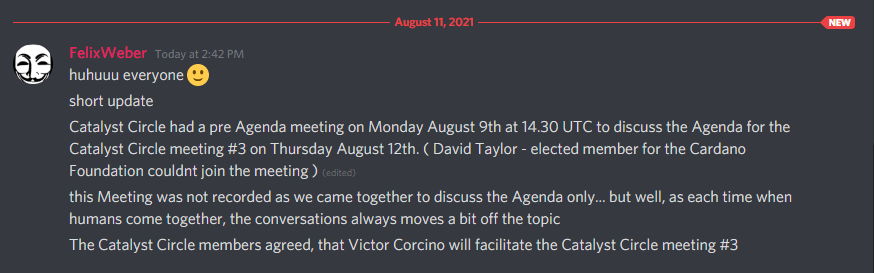
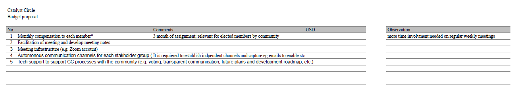

# Meeting 3 - August 12th, 2021

## August 9th, 2021

### Agenda discussion for August 12 CC meeting

Attendance: TBA

\(0:00\) Jump right in: round of questions and/or reactions to the proposed preparations and agenda \(below\) for August 12 agenda. \[Note modify proposed August 12 agenda as we proceed with the round\]

### Proposed August 12 agenda & preparations:

#### PRE-MEETING PREPS

1. Send out meeting reminder. Reminder to include encouragement to update the Trello board so that we don’t have to spend meeting time going over CC action updates. \(Ask if there are any suggested alternatives to Trello.\)
2. Offer to coach volunteer facilitator and circle admin on roles/strategies for Aug 12 meeting

### AGENDA

\(NOTE: New facilitator leads with coaching back up if desired. New circle admin takes notes and/or invites others to take notes\)

0:00 Check in - how arriving in the meeting

0:07 Administrative

* Announcements if any
* Date of next CC meeting: August 26, same time
* Quick review/summary of last meeting. \([Miroboard link](https://miro.com/app/board/o9J_l7a7K40=/)\) [https://trello.com/b/DRBO6qyF/new-board](https://trello.com/b/DRBO6qyF/new-board) 
* Accept content agenda

### Content Agenda

* \(0:12\) Discuss any issues encountered in the past two weeks with the initiatives identified on the Trello board; perhaps modify one or more initiatives.
* \(0:40\) Reference the Miroboard grid used last meeting, identify new Circle actions and assign responsibilities. In addition to items on the Miroboard, add the following items
  * Include new item: Proposal: Assign person \(or team\) to develop plans for election of next Catalyst Circle \(New circle to convene October 7\).
  * Proposal: Schedule 5-hour training \(& possible follow up\) on meeting processes and governance structure concepts, possibly starting the week of August 23. John/Pete to schedule.
  * Proposal: Select who will facilitate and be circle administrator for CC meetings through September 23.  \(eg, select persons for those roles, or rotate, identify team to handle/appoint, or other strategy\)
  * Proposal: continue using Trello to track progress of our initiatives
* \(1:40\) Evaluate meeting [https://forms.gle/yLpZwzgxtarerUhw9](https://forms.gle/yLpZwzgxtarerUhw9) and discuss results of the evaluation.
* \(2:00\) End meeting

\(0:15\) Get consent to the modified August 12 agenda.

\(0:40\) Evaluation of the meeting.

\(0:45\) End of meeting

#### Reference Document



### Outcomes of meeting

#### 11th August, 2021

#### Victor Corcino will facilitate the Catalyst Circle meeting \#3

#### Transcription

Catalyst Circle had a pre Agenda meeting on Monday August 9th at 14.30 UTC to discuss the Agenda for the Catalyst Circle meeting \#3 on Thursday August 12th. \( David Taylor - elected member for the Cardano Foundation couldnt join the meeting \)\(edited\) \[2:45 PM\]

this Meeting was not recorded as we came together to discuss the Agenda only... but well, as each time when humans come together, the conversations always moves a bit off the topic \[2:49 PM\] The Catalyst Circle members agreed, that Victor Corcino will facilitate the Catalyst Circle meeting \#3

## August 12th, 2021 - Meeting 3

Source document :



Agenda Items for CC meeting \#3 Thursday, August 12th. at 17.00 UTC

### Agenda items for CC meeting \#3 - 120min

* Check-in - 7m
* Discuss gathered problem statements - 1.10H - Victor

### Dor on TG:

“_Hey, I'm happy to participate in all discussions, but if I had to prioritize I would pick these 3_

_because I think I can have the most value add there:_

_\(1\) Onboarding_

_\(2\) Faster funds_

_\(3\) CA Reputation_

_And of course, the problems sensed by IOG. Can other share, say 3 problem they want to contribute to, that are not the problems they brought on the board?_“

**Dor:**

\(1\) Onboarding

\(2\) Faster funds

\(3\) CA Reputation

#### Dean:

\(1\) Onboarding

\(2\) Trust/Participation

\(3\) IOHK/Catalyst independence

#### Felix:

\(1\) IOG Statements

\(2\) SPO integration into Catalyst

\(3\) CA Reputation

#### Victor:

\(1\) Onboarding & Introduction

\(2\) Faster Funds

\(3\) Improve cooperation / avoid duplicated effort between IOHK and _\*\*_Community

#### Lauris:

\(1\) Onboarding & Introduction & Awareness

\(2\) SPO integration into Catalyst

\(2\) Faster Funds

#### Juliane:

\(1\)

\(2\)

\(3\)

#### David:

\(1\)

\(2\)

\(3\)

### On-boarding & Introduction & Awareness

### Faster Funds

### CA Reputation

### SPO integration into Catalyst

CC potential evolution - 30m - Juli + Lauris.

Circle Funding - What resourcing is needed to make the Circle more effective? Requirement, next steps, who does what -

How to prioritize/present internal circle proposals? - Felix + Dean

Expectation/Objectives and Roadmap for the next 4 meetings - Dor - 10m

### Suggested Agenda Items for CC meeting \#3

### Thursday, August 12th. at 17.00 UTC

### Agenda items for CC meeting \#3 - 120min

Check-in - 7m

Discuss gathered problem statements - 1.10H - Victor

CC potential evolution - 30m - Juli + Lauris.

Circle Funding - What resourcing is needed to make the Circle more effective? Requirement, next steps, who does what -

How to prioritize/present internal circle proposals? - Felix + Dean

Expectation/Objectives and Roadmap for the next 4 meetings - Dor - 10m

To prioritize:

Discuss voting process for CCv2

Resource commitment

Time sensitive issues

Alternative funding

Decision power

Training \( transition \)

Action Items besides CC meetings \( suggestions \)

Setting up a dev team to develop a circle-tool

Enable resources to pay dev for developing the circle-tool.

Schedule meeting with Lauris, Felix, CF&IOG to explore alternative catalyst funding

Action Items besides CC meetings \( suggestions \)

Setting up a dev team to develop a circle-tool

Enable resources to pay dev for developing the circle-tool.

&lt;&lt;&lt;&lt;&lt;&gt;&gt;&gt;&gt;&gt;

### Lauris suggestions

Resources available for CC to fix the issues we are identifying \( changed \)

Enable Resources to reward CC members \(next round\)

Action Items besides CC meetings \( suggestions \)

Schedule meeting with Lauris, Felix, CF & IOG to explore alternative catalyst funding

&lt;&lt;&lt;&lt;&lt;&gt;&gt;&gt;&gt;&gt;

### Julianes suggestion

CC Expectation/Objectives and Roadmap

&lt;&lt;&lt;&lt;&lt;&gt;&gt;&gt;&gt;&gt;

### Deans suggestions

Start initiative – anti-scammer bots on social media platforms, preventing bad user

experience for newcomers.

Create a dedicated website for Investor Relations and legislation news. Lobbyists for future

legislation \(country specific\)

&lt;&lt;&lt;&lt;&lt;&gt;&gt;&gt;&gt;&gt;

### Felix suggestions

CC Expectation/Objectives and Roadmap

Circle tool & delegate voting power

Action Items besides CC meetings \( suggestions \)

Setting up a dev team to develop a circle-tool

Enable resources to pay dev for developing the circle-tool.

Schedule meeting with Lauris, Felix, CF&IOG to explore alternative catalyst funding

### Summary- suggested Agenda Items

Dean, Felix, Juliane, Lauris, Victor

discuss gathered problem statements \(C\)

discuss voting process for CCv2 \(B\)

CC potentially evolution \(A\)

Expectation/Objectives and Roadmap for the next 4 meetings \(A\)

Enable Resources to reward CC members \(D\)

CC Expectation/Objectives and Roadmap \(A\)

Start initiative – anti-scammer bots on social media platforms, preventing bad user experience for newcomers. \(E\)

Create a dedicated website for Investor Relations and legislation news. Lobbyists for future legislation \(country specific\) \(F\)

CC Expectation/Objectives and Roadmap \(A\)

Circle tool & delegate voting power \(B\)

4x \(A\) CC potentially evolution/ CC Expectation/Objectives and Roadmap

2x \(B\) discuss voting process for CCv2/ Circle tool & delegate voting power

1x \(C\) discuss gathered problem statements

1x \(D\) Enable Resources to reward CC members

1x \(E\) Start initiative – anti-scammer bots on social media platforms, preventing bad user

experience for newcomers.

1x \(F\) Create a dedicated website for Investor Relations and legislation news. Lobbyists for

future legislation \(country specific\)

### Summary- suggested Action Items

Setting up a dev team to develop a circle-tool \(A\)

Enable resources to pay dev for developing the circle-tool. \(B\)

Schedule meeting with Lauris, Felix, CF & IOG to explore alternative catalyst

funding \(C\)

Setting up a dev team to develop a circle-tool \(A\)

Enable resources to pay dev for developing the circle-tool.\(B\)

Schedule meeting with Lauris, Felix, CF&IOG to explore alternative catalyst

funding \(C\)

2x \(A\) Setting up a dev team to develop a circle-tool

2x \(B\) Enable resources to pay dev for developing the circle-tool.

2x \(C\)Schedule meeting with Lauris, Felix, CF&IOG to explore alternative catalyst funding

## DRAFT The Circle exists to fulfill four key goals:

Source document :



#### DRAFT

### The Circle exists to fulfill four key goals:

1\) To facilitate communication between the different functional groups 2\) To provide a heads-up when red lines are crossed within a certain group 3\) To suggest improvements on plans and processes that shape Project Catalyst 4\) To define the election process for Circle V2

### How to prioritize/present internal circle proposals?

This document aims to define how CC members can create, formulate and present new proposals within the Catalyst Circle. It takes the lead from the criteria used in existing Catalyst Proposals.

[https://app.consenz.co.il/document/CC-meeting-agenda/welcome](https://app.consenz.co.il/document/CC-meeting-agenda/welcome)

### Prioritizing.

The priorities are measured against the following criteria

### Criteria

* impact - what impact does your proposal have on the wider situation
* feasibility - how feasible is the proposal over the short, middle or long term 

  ○ - budget - what size budget is required to execute the proposal

* auditability - how thoroughly can the proposal be tracked for progress once adopted 
* adjustability - as this environment is changing constantly and rapidly , proposals have to be flexible to stay in a “just in time” relation
* inclusivity - How many groups can define their needs and interest within the submitted proposal 

### Preparation

Formulate the proposal in collaboration with other CC Members and/or the wider community

* Submit a proposal [https://app.consenz.co.il/document/CC-meeting-agenda/welcome](https://app.consenz.co.il/document/CC-meeting-agenda/welcome) 
* Refine a proposal [https://app.consenz.co.il/document/CC-meeting-agenda/welcome](https://app.consenz.co.il/document/CC-meeting-agenda/welcome) 
* Finalize a proposal \( google- doc, Word or other collaborative services \) 

### Presentation

* Present your proposal in the CC meeting or beside, in a short, and understandable format. 
* Simplify and shorten your final presentation
* Make sure that everyone in the CC has access to your presentation.

## Project Catalyst\_CC budget v1 

Sheet1 

The Circle that monitors the current state and future plans regarding governance in Catalyst. It detects and discusses concerns, objections and opportunities arising within the Catalyst ecosystem. The Circle might By recording meetings and capturing actions in a backlog accessible to all, this activity will provide a view into the hopes, wants, needs, and concerns of the community within Project Catalyst. The Circle is also responsible 

### The Circle exists to fulfill four key goals: 

To facilitate communication between the different functional groups 

To provide a heads-up when red lines are crossed within a certain group 

To suggest improvements on plans and processes that shape Project Catalyst 

To define the election process for Circle V2 

### Member duties and responsibilities 

Like Project Catalyst itself, the Circle will also evolve over time. Initially, elected members will serve 3-month terms, and elections will follow to continue improving and iterating the process. For elected members, Each member of the Circle should: 

Represent the community that selected them 

Exercise their own best judgement about matters that come before the Circle 

Familiarize other members with the projects, activities, aims, hopes, and concerns of their communities 

Periodically take the opportunity to introduce policy proposals into the Circle’s agenda for consideration

Inform their communities about initiatives of the Circle 

### Each member also has the responsibility to: 

Regularly attend meetings every two weeks Maintain an agile backlog list to track issues between meetings Review and comment on agenda issues ahead of time 

Maintain awareness of the interests and concerns of their community 

Disseminate the Circle’s outputs transparently and accessibly 

Learn and practice effective meeting procedures 

Produce an election protocol document for the next elections 

Attend training sessions focused on inclusive and lean startup leadership techniques 

Provide feedback on the effectiveness of the Circle

